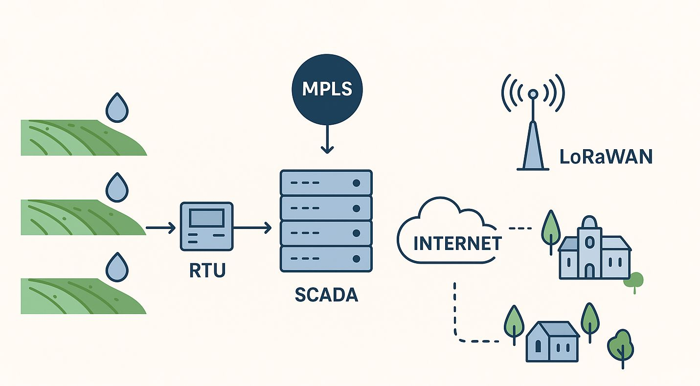

<p align="center">
  
</p>

# IIoT Irrigation Telecontrol

Repository di orchestrazione per una piattaforma IIoT di telecontrollo impianti di irrigazione industriale basata su Docker.

Questo progetto centralizza e definisce:
- **Stack applicativi**: configurazioni dichiarative centralizzate.
- **Utilità di gestione**: interfacce web per orchestrazione autonoma (Dockge, Portainer).
- **Dati persistenti**: volumi bind separati (`appdata/`) per semplificare backup ed update.

L'obiettivo è fornire una piattaforma edge locale robusta, facilmente ripristinabile e versionata.

## Struttura del Repository

Il workspace è stato standardizzato per separare chiaramente lo stato persistente dalle configurazioni dichiarative:

```text
iiot-irrigation-telecontrol/
├── README.md           # Documentazione di progetto
├── bootstrap.sh        # Script per primo avvio (installazione Docker / settaggi)
├── .env.global         # File non tracciato: definisce variabili globali (es. SYS_IP, APPDATA_DIR)
├── assets/             # Dati statici (es. loghi, immagini di documentazione)
├── scripts/            # Strumenti bash di gestione (es. stackctl.sh)
├── dockge/             # Configurazione per orchestrazione stack Compose
├── stacks/             # Definizioni container logicamente segmentate 
│   ├── homepage/       # Dashboard principale 
│   ├── speckle/        # Piattaforma dati 
│   ├── openproject/    # Project Management
│   └── ...
└── appdata/            # [NON TRACCIATO] Dati applicativi persistenti e volumi bind 
```

## Prerequisiti

Per eseguire i servizi, l'host Linux necessita di:
- Accesso utente con privilegi `sudo`
- **Docker Engine** e plug-in **Docker Compose**
- Rete condivisa locale attiva

## Nuova Installazione e Avvio Rapido

In caso di nuova installazione o "factory reset" su un edge target (es. server x86 o single-board PC):

1. Clonare il repository nella directory desiderata (es. `/home/luca/Docker`).
2. Configurare le variabili in `.env.global` (assicurarsi di tracciare la rete corretta su `SYS_IP`).
3. Avviare lo script dedicato:

```bash
chmod +x bootstrap.sh
./bootstrap.sh
```

Lo script si occuperà di installare Docker (se mancante), configurare l'utente corrente, allocare la cartella `appdata/` isolata dal VCS, e fare il deploy automatico di **Dockge** (porta `5001`). Una volta avviato, la Web UI permetterà di istanziare autonomamente le restanti code applicative (`stacks/*`).

## Gestione Centralizzata CLI

Per un'amministrazione rapida da terminale senza entrare in ciascuna directory, usare `scripts/stackctl.sh`.

```bash
cd scripts/
chmod +x stackctl.sh

# Status globale sugli stack
./stackctl.sh list-active

# Avvio o arresto esplicito degli stack
./stackctl.sh up-active
./stackctl.sh down-active

# Controllo selettivo di un servizio
./stackctl.sh up speckle
./stackctl.sh logs openproject 200
```

## Policy di Rete e Persistenza

**Networking**: Tutti i servizi si scambiano traffico sensibile sulla rete docker dedicata `iiot_internal`. Le porte vengono esposte all'host unicamente se previste per traffico utente.
**Dati Locali**: Tutto lo stato modificabile dai servizi viene segregato in `appdata/` o in docker volumes tracciati ma esclusi dal controllo versione (`.gitignore`).  Si raccomanda di configurare lo snapshot o il backup periodico esclusivamente di tale folder (es. compressione `tar` di `appdata/`).

## Disclaimer
Questa piattaforma viene formita *as-is* per implementazioni industriali e prototipiche locali, senza specifica garanzia prestazionale.
